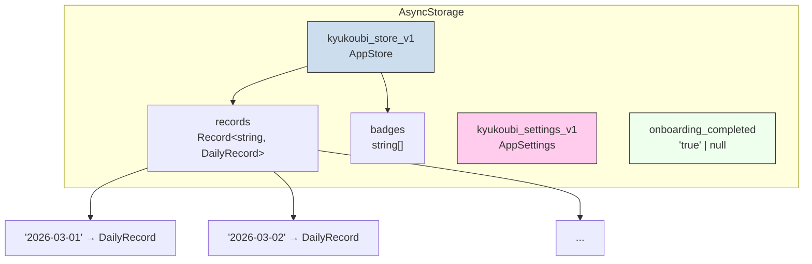

# データモデル設計書：休肝日つくーる

## 1. 設計方針

本アプリのデータモデルは、ユーザーの飲酒習慣に関するデータを効率的かつシンプルに管理することを目的とする。MVP段階では、すべてのデータをAsyncStorageにJSON形式でローカル保存する。キーバリューストアの特性を活かし、日付をキーとしたフラットな構造で管理する。

## 2. データ構造概要



## 3. 型定義

### 3.1. DayStatus

その日の飲酒状態を示す列挙型。

| 値 | 意味 |
| :--- | :--- |
| `"kyukan"` | 休肝日（飲酒しない） |
| `"ok"` | 飲酒OK日（飲酒する） |
| `"undecided"` | 未定（まだ決めていない） |

### 3.2. DailyRecord

各日の記録を保持するインターフェース。

| フィールド | 型 | 説明 | デフォルト |
| :--- | :--- | :--- | :--- |
| `date` | `string` | 日付（`"YYYY-MM-DD"`） | - |
| `status` | `DayStatus` | その日の状態 | `"undecided"` |
| `declaredLimit` | `number \| null` | 飲酒前に宣言した上限杯数 | `null` |
| `drinkingReason` | `string \| null` | 飲みたい理由（選択肢） | `null` |
| `actualDrinks` | `number \| null` | 実際に飲んだ杯数 | `null` |
| `satisfaction` | `"great" \| "okay" \| "regret" \| "toomuch" \| null` | 飲酒後の満足度 | `null` |
| `memo` | `string` | フリーテキストメモ | `""` |
| `alternativeAction` | `string \| null` | 実行した代替行動 | `null` |

### 3.3. AppStore

アプリのメインデータストア。

| フィールド | 型 | 説明 |
| :--- | :--- | :--- |
| `records` | `Record<string, DailyRecord>` | 全日次記録（キー: `"YYYY-MM-DD"`） |
| `badges` | `string[]` | 解除済みバッジIDの配列 |

### 3.4. AppSettings

アプリの設定情報。

| フィールド | 型 | 説明 | デフォルト |
| :--- | :--- | :--- | :--- |
| `weeklyGoalDays` | `number` | 週の休肝日目標日数（1〜5） | `2` |
| `requireConsecutive` | `boolean` | 2連続休肝日を目指すか | `true` |
| `reminderEnabled` | `boolean` | 夜間リマインダーの ON/OFF | `false` |
| `reminderTime` | `string` | リマインダー時刻（`"HH:mm"`） | `"20:00"` |
| `achievementNotification` | `boolean` | 達成通知の ON/OFF | `true` |

## 4. AsyncStorageキー

| キー | 値の型 | 説明 |
| :--- | :--- | :--- |
| `kyukoubi_store_v1` | `AppStore` (JSON) | メインデータストア |
| `kyukoubi_settings_v1` | `AppSettings` (JSON) | 設定情報 |
| `onboarding_completed` | `"true" \| null` | オンボーディング完了フラグ |
| `notification_permission_requested` | `"true" \| null` | 通知権限リクエスト済みフラグ |

新しいキーを追加するときは `kyukoubi_xxx_v1` の形式で統一する。

## 5. データ操作関数（lib/store.ts）

### ストア操作

| 関数 | 説明 |
| :--- | :--- |
| `loadStore()` | AsyncStorageからAppStoreを読み込む |
| `saveStore(store)` | AppStoreをAsyncStorageに保存する |
| `updateRecord(date, patch)` | 指定日のDailyRecordを部分更新し保存する |
| `loadSettings()` | AsyncStorageからAppSettingsを読み込む |
| `saveSettings(settings)` | AppSettingsをAsyncStorageに保存する |
| `clearAllData()` | 全データ（store・settings・onboarding）を削除する |

### ユーティリティ関数

| 関数 | 説明 |
| :--- | :--- |
| `todayStr()` | 今日の日付を`"YYYY-MM-DD"`で返す |
| `getWeekDates(ref?)` | 指定日を含む週（月〜日）の日付配列を返す |
| `formatDateJP(dateStr)` | `"M月D日（曜）"` 形式にフォーマット |
| `formatMonthDayJP(dateStr)` | `"M/D"` 形式にフォーマット |
| `getDayLabel(dateStr)` | 曜日ラベル（月・火・水…）を返す |
| `hasConsecutiveKyukan(records, weekDates)` | 週内に2連続休肝日があるか判定 |
| `canAchieveConsecutiveIfDrink(records, weekDates, today)` | 今日飲んでも2連続達成可能か判定 |
| `defaultRecord(date)` | 指定日の初期DailyRecordを返す |
| `defaultSettings()` | デフォルトのAppSettingsを返す |

### 分析関数

| 関数 | 説明 |
| :--- | :--- |
| `computeWeekdayAverages(records)` | 過去28日間の曜日別平均飲酒杯数 |
| `computeMonthlySummary(records, year, month, goalDays)` | 月次サマリー（休肝日数・前月比・達成率・コメント） |

### バッジ関数

| 関数 | 説明 |
| :--- | :--- |
| `checkNewBadges(records, existingBadges, goalDays)` | 新たに獲得したバッジIDの配列を返す |

## 6. データ操作フック（lib/app-context.tsx）

画面からのデータ操作は `useAppStore()` フックを通じて行う。

```typescript
const {
  store,           // AppStore
  today,           // "YYYY-MM-DD"
  getRecord,       // (date) => DailyRecord
  patchRecord,     // (date, patch) => Promise<void>
  refreshStore,    // () => Promise<void>
  settings,        // AppSettings
  patchSettings,   // (patch) => Promise<void>
  resetAllData,    // () => Promise<void>
} = useAppStore();
```

**`patchRecord` の副作用:**
- レコード更新後に `checkNewBadges()` を実行し、新バッジがあれば `AppStore.badges` に追加
- `status: "kyukan"` 設定時、`achievementNotification` が有効かつ2連続達成なら達成通知を送信

## 7. データ永続化方針

- **オフラインファースト**: すべてのデータはAsyncStorageにローカル保存。ネットワーク接続不要。
- **JSONシリアライゼーション**: データはJSON形式で保存。型安全性はTypeScriptの型定義で担保。
- **バージョニング**: キー名に `_v1` サフィックスを付与し、将来のスキーマ変更に備える。
- **将来の拡張**: バックエンド導入時は、AsyncStorageのデータをAPI経由で同期するアーキテクチャへの移行を想定する。
