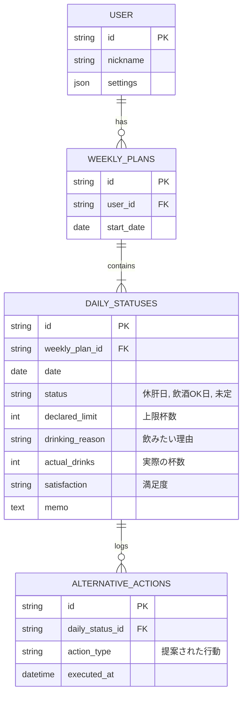

# データモデル設計書：休肝日つくーる

## 1. 設計方針

本アプリのデータモデルは、ユーザーの飲酒習慣に関するデータを効率的かつ安全に管理することを目的とする。MVP（Minimum Viable Product）段階では、データは主にユーザーのデバイス内にローカルで保存する。将来的なデータ同期やバックアップ機能を考慮し、拡張性の高いスキーマ設計を目指す。

## 2. ER図

## 3. テーブル定義

### 3.1. ユーザー (users)

ユーザーアカウント情報を格納する。MVPでは単一ユーザーを想定し、デバイス固有IDで識別する。

| カラム名 | 型 | 説明 | 制約 |
| :--- | :--- | :--- | :--- |
| `id` | `string` | ユーザーID（デバイス固有IDなど） | Primary Key |
| `nickname` | `string` | ニックネーム（将来用） | - |
| `settings` | `json` | 通知設定などのアプリ設定 | - |

### 3.2. 週間計画 (weekly_plans)

週単位の計画を管理する。

| カラム名 | 型 | 説明 | 制約 |
| :--- | :--- | :--- | :--- |
| `id` | `string` | 週間計画ID | Primary Key |
| `user_id` | `string` | ユーザーID | Foreign Key (users.id) |
| `start_date` | `date` | 週の開始日（例: 月曜日） | Not Null |

### 3.3. 日次ステータス (daily_statuses)

各日の状態、宣言、実績を記録する中心的なテーブル。

| カラム名 | 型 | 説明 | 制約 |
| :--- | :--- | :--- | :--- |
| `id` | `string` | 日次ステータスID | Primary Key |
| `weekly_plan_id` | `string` | 週間計画ID | Foreign Key (weekly_plans.id) |
| `date` | `date` | 日付 | Not Null |
| `status` | `enum` | その日の状態（休肝日, 飲酒OK日, 未定） | Not Null |
| `declared_limit` | `integer` | 飲酒前の宣言上限杯数 | Nullable |
| `drinking_reason` | `string` | 飲みたい理由の選択肢 | Nullable |
| `actual_drinks` | `integer` | 実際に飲んだ杯数 | Nullable |
| `satisfaction` | `string` | 飲酒後の満足度（将来用） | Nullable |
| `memo` | `text` | フリーテキストのメモ | Nullable |

### 3.4. 代替行動ログ (alternative_actions)

ユーザーが実行した代替行動を記録する。

| カラム名 | 型 | 説明 | 制約 |
| :--- | :--- | :--- | :--- |
| `id` | `string` | 代替行動ログID | Primary Key |
| `daily_status_id` | `string` | 日次ステータスID | Foreign Key (daily_statuses.id) |
| `action_type` | `string` | 実行した代替行動の種類 | Not Null |
| `executed_at` | `datetime` | 実行日時 | Not Null |

## 4. データ永続化方針

- **ローカルデータベース**: MVP段階では、上記テーブル構造をリレーショナルなローカルデータベースで実現する。Expo環境で動作し、リレーションを扱える **WatermelonDB** を第一候補とする。これにより、オフラインでの動作を保証し、パフォーマンスを向上させる。
- **将来の拡張**: 将来的に複数デバイス間でのデータ同期が必要になった場合、バックエンドを構築し、ローカルDBとAPI経由でデータを同期するアーキテクチャへの移行を想定する。
