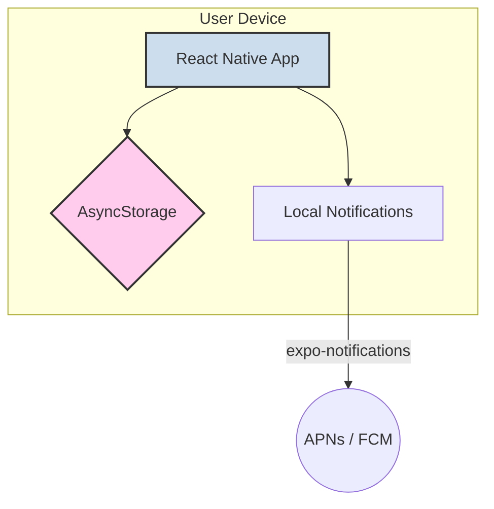

# 技術スタック設計書：休肝日つくーる

## 1. 設計方針

本アプリは、iOSおよびAndroidの両プラットフォームで迅速に高品質なネイティブアプリを開発することを目的とし、Expoをベースとした技術スタックを採用する。開発効率、パフォーマンス、将来の拡張性を考慮し、モダンで実績のあるライブラリを選定する。

## 2. 全体アーキテクチャ

MVP段階では、バックエンドサーバーを持たない**オフラインファースト・アーキテクチャ**を採用する。すべてのデータはユーザーのデバイス内のAsyncStorageに保存され、アプリはオフラインでも完全に機能する。

- **フロントエンド**: Expo (React Native) によるネイティブアプリケーション
- **データ永続化**: AsyncStorage（キーバリューストア）
- **通知**: expo-notifications（ローカル通知）

## 3. フロントエンド技術スタック

| カテゴリ | 技術・ライブラリ | バージョン | 選定理由 |
| :--- | :--- | :--- | :--- |
| **フレームワーク** | **Expo (React Native)** | SDK 54 / RN 0.81 | 単一コードベースでiOS/Android/Webに対応。ネイティブ機能へのアクセスが容易。 |
| **言語** | **TypeScript** | 5.9 | 静的型付けにより開発時のエラーを早期検出。 |
| **ルーティング** | **Expo Router** | v6 | ファイルベースルーティングで画面管理がシンプル。Deep Linking対応。 |
| **スタイリング** | **NativeWind** | v4 | Tailwind CSSのユーティリティファーストアプローチをReact Nativeに適用。 |
| **状態管理** | **React Context + AsyncStorage** | - | 軽量かつシンプル。外部ライブラリ不要で本アプリの要件に十分。 |
| **アニメーション** | **react-native-reanimated** | 4.x | UIスレッドでの高パフォーマンスなアニメーション実行。 |
| **ジェスチャー** | **react-native-gesture-handler** | - | ネイティブレベルのジェスチャー処理。 |
| **グラフ・可視化** | **react-native-svg** | - | SVGベースの軽量な棒グラフ描画（曜日別飲酒量チャート）。 |
| **アイコン** | **@expo/vector-icons (MaterialIcons)** | - | 豊富なアイコンセット。SF Symbols互換マッピングあり。 |

## 4. データ永続化

| カテゴリ | 技術・ライブラリ | 選定理由 |
| :--- | :--- | :--- |
| **ローカルストレージ** | **AsyncStorage** | React Nativeの標準的なキーバリューストア。本アプリのデータ量（日次記録・設定）には十分な性能。シンプルなJSON保存でスキーマ管理が容易。 |

### AsyncStorageキー一覧

| キー | 内容 |
| :--- | :--- |
| `kyukoubi_store_v1` | AppStore（全DailyRecord + badges） |
| `kyukoubi_settings_v1` | AppSettings（目標・通知設定） |
| `onboarding_completed` | オンボーディング完了フラグ |

## 5. その他・ツール

| カテゴリ | 技術・ライブラリ | 選定理由 |
| :--- | :--- | :--- |
| **ローカル通知** | **expo-notifications** | リマインダー通知・達成通知をローカルで送信。APNs/FCM対応。 |
| **ハプティクス** | **expo-haptics** | ボタンタップ・トグル切替・達成時の触覚フィードバック。 |
| **テスト** | **Vitest** | 高速なユニットテストランナー。ESM対応。 |
| **リンター** | **ESLint** | コードの一貫性と品質を自動的に維持。 |
| **フォーマッター** | **Prettier** | コードスタイルの統一。 |
| **バージョン管理** | **Git / GitHub** | ソースコードのバージョン管理。 |

## 6. 将来の拡張性

本技術スタックは、将来的な機能拡張にも柔軟に対応可能である。

- **バックエンドの導入**: ユーザーデータのバックアップや複数デバイス間での同期機能が必要になった場合、REST APIを持つバックエンドを構築し、AsyncStorageのデータをAPI経由で同期させることが可能である。
- **データベースの移行**: データ量が増大した場合、AsyncStorageからSQLite（expo-sqlite）への移行が容易な設計となっている。
- **AI機能の統合**: AIによる個別アドバイス機能を実装する際には、バックエンドに機械学習モデルをデプロイし、API経由でアプリから利用する構成が考えられる。
