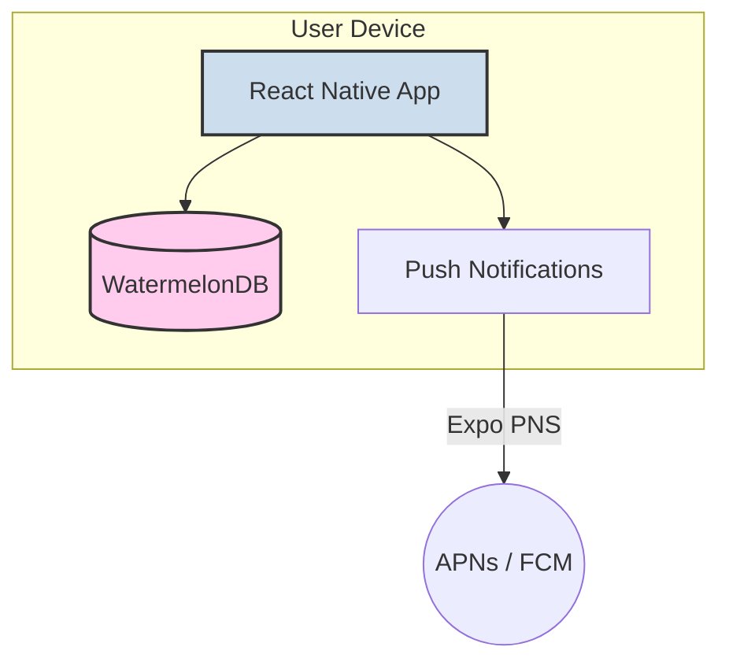

# 技術スタック設計書：休肝日つくーる

## 1. 設計方針

本アプリは、iOSおよびAndroidの両プラットフォームで迅速に高品質なネイティブアプリを開発することを目的とし、Expoをベースとした技術スタックを採用する。開発効率、パフォーマンス、将来の拡張性を考慮し、モダンで実績のあるライブラリを選定する。

## 2. 全体アーキテクチャ

MVP（Minimum Viable Product）段階では、バックエンドサーバーを持たない**サーバーレス・アーキテクチャ**を採用する。すべてのデータはユーザーのデバイス内のローカルデータベースに保存され、アプリはオフラインでも完全に機能する。

- **フロントエンド**: Expo (React Native) によるネイティブアプリケーション
- **データベース**: デバイス内蔵のローカルデータベース (WatermelonDB)
- **通知**: Expo Push Notificationsサービスを利用

## 3. フロントエンド技術スタック

| カテゴリ | 技術・ライブラリ | 選定理由 |
| :--- | :--- | :--- |
| **フレームワーク** | **Expo (React Native)** | 単一のコードベースでiOSとAndroidアプリを開発可能。ネイティブ機能へのアクセスが容易で、開発サイクルを高速化できるため。 |
| **言語** | **TypeScript** | 静的型付けにより、開発時のエラーを早期に検出し、コードの品質と保守性を向上させるため。 |
| **UIライブラリ** | **NativeWind** | Tailwind CSSのユーティリティファーストなアプローチをReact Nativeにもたらす。迅速なUI構築と、デザインの一貫性を保ちやすいため。 |
| **状態管理** | **Zustand** | シンプルで直感的なAPIを持つ軽量な状態管理ライブラリ。ボイラープレートが少なく、本アプリの要件に対して十分な機能を持つため。 |
| **ナビゲーション** | **React Navigation** | React Nativeにおけるデファクトスタンダード。宣言的なAPIで複雑な画面遷移も容易に実装でき、コミュニティも活発なため。 |
| **グラフ・可視化** | **Victory Native** | 振り返り画面でのデータ可視化に使用。カスタマイズ性が高く、インタラクティブなグラフを容易に作成できるため。 |

## 4. データベース技術スタック

| カテゴリ | 技術・ライブラリ | 選定理由 |
| :--- | :--- | :--- |
| **ローカルDB** | **WatermelonDB** | 高速なオフラインファーストのリアクティブデータベース。SQLiteをベースにしており、大量のデータを扱ってもパフォーマンスが劣化しにくい。リレーショナルなデータモデルを扱え、本アプリの設計に適しているため。 |

## 5. その他・ツール

| カテゴリ | 技術・ライブラリ | 選定理由 |
| :--- | :--- | :--- |
| **プッシュ通知** | **Expo Push Notifications** | Expoが提供する統一されたAPIを通じて、Apple (APNs) とGoogle (FCM) の両プラットフォームに簡単にプッシュ通知を実装できるため。 |
| **開発ツール** | **ESLint, Prettier** | コードの一貫性を保ち、品質を自動的に維持するための標準的なリンターおよびフォーマッター。 |
| **バージョン管理** | **Git / GitHub** | ソースコードのバージョン管理とチームでの共同開発を円滑に進めるための標準的なプラットフォーム。 |

## 6. 将来の拡張性

本技術スタックは、将来的な機能拡張にも柔軟に対応可能である。

- **バックエンドの導入**: ユーザーデータのバックアップや複数デバイス間での同期機能が必要になった場合、REST APIまたはGraphQL APIを持つバックエンド（例: Node.js, Firebase）を構築し、WatermelonDBの同期機能と連携させることが可能である。
- **AI機能の統合**: AIによる個別アドバイス機能を実装する際には、バックエンドに機械学習モデルをデプロイし、API経由でアプリから利用する構成が考えられる。
