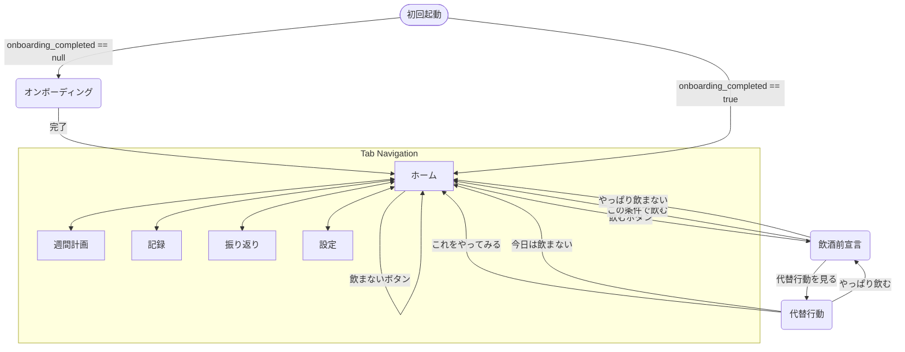

# 画面設計書：休肝日つくーる

## 1. 全体構成

本アプリは、主要な機能を5つのタブに集約したシンプルな構成とする。UIは親しみやすさを重視し、ユーザーが直感的に操作できるデザインを目指す。

- **タブ構成**:
  1. **ホーム** (`index.tsx`): 今日の行動を決定するための中心画面。
  2. **週間計画** (`weekly.tsx`): 週全体の飲酒計画を立てる画面。
  3. **記録** (`record.tsx`): 飲酒の実績を簡単に入力する画面。
  4. **振り返り** (`review.tsx`): 過去のデータを分析し、成果を確認する画面。
  5. **設定** (`settings.tsx`): 目標・通知・データ管理の設定画面。
- **モーダル画面**:
  - **飲酒前宣言** (`declaration.tsx`): 飲酒前にルールを設定するモーダル。
  - **代替行動** (`alternative.tsx`): 飲酒欲求を別の行動で置き換えるモーダル。
  - **オンボーディング** (`onboarding.tsx`): 初回起動時のセットアップ（fullScreenModal）。

## 2. 画面遷移図

## 3. 各画面の詳細設計

### 3.1. オンボーディング画面 (onboarding.tsx)

- **役割**: 初回起動時にアプリの概要を紹介し、基本設定を行う。
- **表示**: fullScreenModalとして表示。`onboarding_completed` が null のときのみ遷移。
- **ステップ**:
  1. **イントロ**: アプリの目的と使い方の概要。
  2. **目標設定**: 週の休肝日目標日数（`weeklyGoalDays`）、2連続休肝日の目標（`requireConsecutive`）を設定。
  3. **通知設定**: リマインダーの ON/OFF（`reminderEnabled`）、時刻選択（19:00 / 20:00 / 21:00 / 22:00）。
- **完了時**: 設定を `patchSettings()` で保存、通知権限をリクエスト、`onboarding_completed = "true"` を保存し、タブ画面へ遷移。

### 3.2. ホーム画面 (index.tsx / SC-01)

- **役割**: ユーザーが「今日どうするか」を迷わず判断できるように支援する。
- **表示項目**:
  - 今日の日付
  - **今日の判定**: 「休肝日」「飲酒OK日」「未定」を大きく明確に表示。
  - **週の進捗**: 連続休肝日の達成状況。
  - **影響の可視化**: 「今日飲むと2連休肝は土日しか残りません」といった警告や助言。
  - **バッジ一覧**: `BadgeList` コンポーネントで解除済みバッジを表示。
- **アクション**:
  - 「今日は飲む」ボタン → 飲酒前宣言画面へ遷移。
  - 「今日は飲まない」ボタン → 休肝日として記録。
  - 「代替行動を見る」ボタン → 代替行動画面へ遷移。

### 3.3. 週間計画画面 (weekly.tsx / SC-02)

- **役割**: 1週間の飲酒・休肝計画を視覚的に設定する。
- **表示項目**:
  - 1週間の曜日リスト（月曜始まり）。
  - 各日の状態（休肝日/飲酒OK日/未定）を示すアイコンや色分け。
  - **2連続休肝日の達成見込み**: 警告メッセージ。
- **操作**:
  - 各曜日をタップすることで、状態をトグルで変更。

### 3.4. 飲酒前宣言画面 (declaration.tsx / SC-03)

- **役割**: 飲酒を開始する前に、ユーザー自身にルールを設定させることで無計画な飲酒を防ぐ。
- **表示**: モーダル（`presentation: "modal"`）。
- **入力項目**:
  - **上限杯数**: 1〜4杯の選択肢。
  - **飲みたい理由**: 「なんとなく」「ストレス」「食事と一緒」「ご褒美」「習慣」「誘われた」「暇だった」「寝る前に落ち着きたい」。
  - **メモ**（任意）。
- **アクション**:
  - 「この条件で飲む」→ `patchRecord(today, { status: "ok", declaredLimit, drinkingReason, memo })` → ホームに戻る。
  - 「代替行動を見る」→ 代替行動画面へ `router.replace`。
  - 「やっぱり今日は飲まない」→ `patchRecord(today, { status: "kyukan" })` → ホームに戻る。

### 3.5. 代替行動画面 (alternative.tsx / SC-04)

- **役割**: 飲酒欲求を感じた際に、その欲求を別の行動で満たすための選択肢を提示する。
- **表示**: モーダル（`presentation: "modal"`）。
- **気分選択**: stress / bored / habit / meal / reward
- **代替行動一覧**（8種類、気分に応じてフィルタリング）:

| ID | タイトル | 説明 | 対応する気分 |
| :--- | :--- | :--- | :--- |
| sparkling | 炭酸水を飲む | 口寂しさを満たせます | habit, meal, bored |
| tea | 温かい飲み物を飲む | リラックス効果があります | stress, habit |
| teeth | 先に歯を磨く | 飲む気が失せやすいです | habit, bored |
| walk | 軽く散歩する | 気分転換になります | stress, bored |
| stretch | ストレッチをする | 体の緊張をほぐします | stress |
| bath | お風呂に入る | リラックスして眠れます | stress, reward |
| snack | 甘いものを食べる | 満足感が得られます | reward, meal |
| game | ゲームをする | 気が紛れます | bored, habit |

- **5分タイマー**: 「5分だけやってみる」タイマー機能（300秒）。開始/一時停止/リセット可能。
- **アクション**:
  - 「これをやってみる」→ `patchRecord(today, { status: "kyukan", alternativeAction: action.title })` → ホームに戻る。
  - 「やっぱり飲む」→ 飲酒前宣言画面へ `router.replace`。
  - 「今日は飲まない」→ `patchRecord(today, { status: "kyukan" })` → ホームに戻る。

### 3.6. 記録画面 (record.tsx / SC-05)

- **役割**: 飲酒後の実績を簡単に入力させる。今日だけでなく過去の日付も記録・修正できる。
- **日付ナビゲーション**:
  - ヘッダーに左右矢印ボタン（`‹` `›`）と日付表示を配置。
  - 左矢印で前日、右矢印で翌日に移動。未来の日付には進めない。
  - 今日を表示中は日付横に「今日」バッジを表示。
  - 過去日を表示中は「今日に戻る」ボタンを表示。
  - 日付変更時にローカルstate（杯数・満足度・メモ）を選択日のレコードから再設定。
- **入力項目**:
  - **実際の杯数**: 上限宣言と比較して表示。
  - **上限達成状況**: 「守れた」「上限オーバー」などを自動判定。
  - 満足度、メモ（任意）。
- **UIの工夫**:
  - 宣言時の上限杯数を表示し、それと比較してどうだったかを視覚的に見せる。
  - 過去日の場合「今日は〜」→「この日は〜」にラベルを切替。

### 3.7. 振り返り画面 (review.tsx / SC-06)

- **役割**: 過去の行動をデータで振り返り、自身の傾向を把握し、モチベーションを維持する。
- **表示項目**:
  - **月次サマリー**: 休肝日数、前月比、達成率、コメント（`computeMonthlySummary()`）。
  - **曜日別チャート**: 曜日ごとの平均飲酒杯数を棒グラフで表示（`WeekdayChart` + `computeWeekdayAverages()`）。
  - **バッジ一覧**: 解除済み・未解除バッジの表示（`BadgeList`）。

### 3.8. 設定画面 (settings.tsx / SC-07)

- **役割**: アプリの各種設定を管理する。
- **セクション**:
  1. **目標設定**:
     - 週の休肝日目標日数（1〜5のステッパー）
     - 2連続休肝日目標の ON/OFF（Switch）
  2. **通知設定**:
     - リマインダー ON/OFF（Switch）
     - リマインダー時刻の表示
     - 達成通知 ON/OFF（Switch）
  3. **データ管理**:
     - 「全データリセット」ボタン（確認ダイアログ付き）
- **データ操作**: `useAppStore()` の `settings`, `patchSettings`, `resetAllData` を使用。
