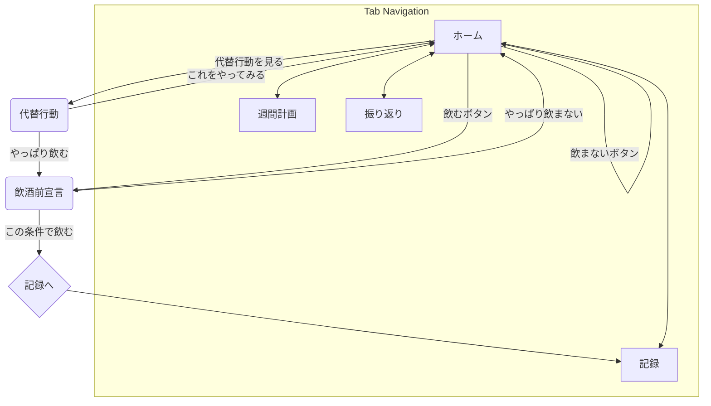

# 画面設計書：休肝日つくーる

## 1. 全体構成

本アプリは、主要な機能を4つのタブに集約したシンプルな構成とする。UIは親しみやすさを重視し、ユーザーが直感的に操作できるデザインを目指す。

- **タブ構成**: 
  1. **ホーム**: 今日の行動を決定するための中心画面。
  2. **週間計画**: 週全体の飲酒計画を立てる画面。
  3. **記録**: 飲酒の実績を簡単に入力する画面。
  4. **振り返り**: 過去のデータを分析し、成果を確認する画面。
- **設定画面**: 右上のアイコンなどからアクセス可能とする。

## 2. 画面遷移図

## 3. 各画面の詳細設計

### 3.1. ホーム画面 (ID: SC-01)

- **役割**: ユーザーが「今日どうするか」を迷わず判断できるように支援する。
- **表示項目**:
  - 今日の日付
  - **今日の判定**: 「休肝日」「飲酒OK日」「未定」などを大きく、明確に表示。
  - **週の進捗**: 「連続休肝日」の達成状況（例：未達成、1日達成中、達成済み）。
  - **影響の可視化**: 「今日飲むと2連休肝は土日しか残りません」といった警告や助言。
- **アクション**:
  - 「今日は飲む」ボタン → 飲酒前宣言画面へ遷移。
  - 「今日は飲まない」ボタン → 意思決定を記録。
  - 「理由を記録」ボタン → 飲みたい理由の記録モーダルを表示。
  - 「代替行動を見る」ボタン → 代替行動画面へ遷移。

### 3.2. 週間計画画面 (ID: SC-02)

- **役割**: 1週間の飲酒・休肝計画を視覚的に設定する。
- **表示項目**:
  - 1週間の曜日リスト（月曜始まりなど）。
  - 各日の状態（休肝日/飲酒OK日/未定）を示すアイコンや色分け。
  - **2連続休肝日の達成見込み**: 「このままだと達成できません」などの警告メッセージ。
- **操作**:
  - 各曜日をタップすることで、状態を「休肝日」→「飲酒OK日」→「未定」のようにトグルで変更できる。または、タップ時にボトムシートで選択させる。

### 3.3. 飲酒前宣言画面 (ID: SC-03)

- **役割**: 飲酒を開始する前に、ユーザー自身にルールを設定させることで、無計画な飲酒を防ぐ。
- **入力項目**:
  - **上限杯数**: 1杯、2杯、3杯などの選択肢。
  - **飲みたい理由**: 「ストレス」「習慣」などの選択肢。
  - 開始時刻、メモ（任意）。
- **アクション**:
  - 「この条件で飲む」ボタン → 宣言を記録し、ホーム画面に戻る。
  - 「やっぱり今日は飲まない」ボタン → ホーム画面に戻る。

### 3.4. 代替行動画面 (ID: SC-04)

- **役割**: 飲酒欲求を感じた際に、その欲求を別の行動で満たすための選択肢を提示する。
- **表示項目**:
  - 現在の気分（例：ストレス、暇など）に応じた推奨代替行動リスト。
  - 各代替行動の簡単な説明。
  - 「5分だけやってみる」などのタイマー機能。
- **アクション**:
  - 「これをやってみる」ボタン → 選択した行動を記録し、ホーム画面に戻る。
  - 「やっぱり飲む」ボタン → 飲酒前宣言画面へ遷移。

### 3.5. 記録画面 (ID: SC-05)

- **役割**: 飲酒後の実績を簡単に入力させる。
- **入力項目**:
  - **実際の杯数**: 上限宣言と比較して表示。
  - **上限達成状況**: 「守れた」「上限オーバー」などを自動判定。
  - 満足度、メモ（任意）。
- **UIの工夫**: 宣言時の上限杯数を表示し、それと比較してどうだったかを視覚的に分かりやすく見せる。

### 3.6. 振り返り画面 (ID: SC-06)

- **役割**: 過去の行動をデータで振り返り、自身の傾向を把握し、モチベーションを維持する。
- **表示項目**:
  - **週次ビュー**: 飲酒日数、総杯数、休肝日数、上限順守率など。
  - **月次ビュー**: 各指標の推移、飲みたい理由のランキング、効果的だった代替行動のランキングなど。
  - **分析コメント**: 「木曜日に飲む傾向があります」「ストレスを感じた日は上限を超過しやすいです」といったインサイトを提示。
